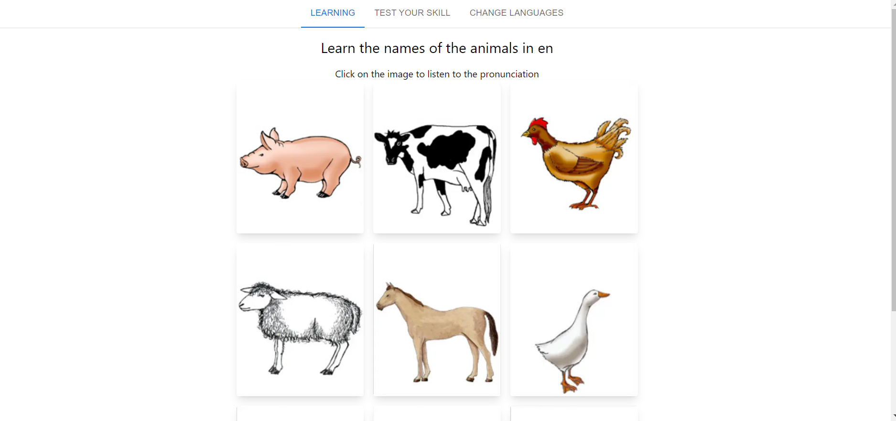

# Application d’apprentissage de vocabulaires

L'application est un projet [Next.js](https://nextjs.org/) qui nécéssite [Node.js](https://nodejs.org/en/) pour fonctionner.

## Getting Started

Tout d'abord, installer les dépendances du projet:

```bash
npm install
# or
yarn install
# or
pnpm install
# or
bun install
```

Ensuite, lancer le serveur de développement:

```bash
npm run dev
# or
yarn dev
# or
pnpm dev
# or
bun dev
```

Enfin, ouvrir [http://localhost:3000](http://localhost:3000) avec votre navigateur pour voir le résultat.

Capture d'écran de l'interface :


